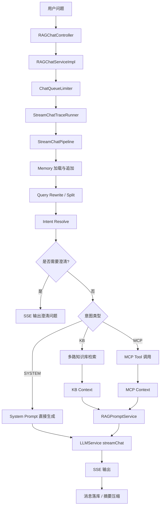
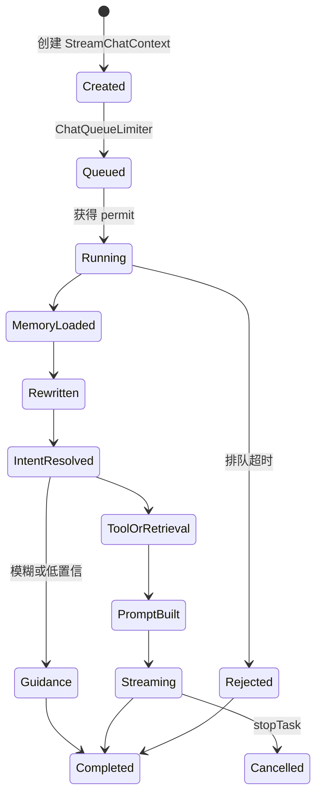

# Agent 架构分析

# Agent 入口

项目没有单独命名为 `Agent` 的总控类，Agent 能力由 RAG 对话流水线承载。

入口：

```text
RAGChatController.chat
RAGChatServiceImpl.streamChat
StreamChatPipeline.execute
```

`RAGChatServiceImpl` 为每次请求创建：

- `conversationId`
- `taskId`
- `StreamCallback`
- `StreamChatContext`

然后交给 `StreamChatPipeline` 执行。

# Agent 是如何运行的

运行步骤：

1. 接收用户问题。
2. 创建对话上下文 `StreamChatContext`。
3. 进入公平排队限流。
4. 开启 Trace。
5. 加载并追加会话记忆。
6. 使用 LLM 改写和拆分问题。
7. 使用 LLM 对意图树叶子节点打分。
8. 判断是否需要澄清引导。
9. 判断是否是 SYSTEM-only 意图。
10. 对 KB 意图走知识库检索，对 MCP 意图走工具调用。
11. 将 KB/MCP 证据格式化。
12. 根据场景选择 Prompt 模板。
13. 调用 LLM 流式生成。
14. 将回答、思考内容、结束事件通过 SSE 返回。
15. 追加会话消息，必要时触发摘要压缩。

# Agent 生命周期

一次 Agent 生命周期对应一次 `/rag/v3/chat` 请求：

```text
请求进入 -> 上下文创建 -> 排队/准入 -> 记忆加载 -> 计划/路由 -> 工具/检索执行 -> Prompt 组装 -> LLM 生成 -> SSE 完成 -> 记忆落库/摘要
```

项目中的生命周期对象：

- `StreamChatContext`：单次请求上下文。
- `taskId`：流式任务 ID，可取消。
- `conversationId`：长期会话 ID。
- `RagTraceRunDO` / `RagTraceNodeDO`：链路追踪生命周期。
- `ConversationDO` / `ConversationMessageDO` / `ConversationSummaryDO`：会话生命周期。

# Agent 上下文如何传递

上下文来源：

- HTTP 参数：`question`、`conversationId`、`deepThinking`
- 用户上下文：`UserContext.getUserId()`
- 会话历史：`ConversationMemoryService`
- 摘要：`ConversationMemorySummaryService`
- 意图结果：`SubQuestionIntent`
- 检索结果：`RetrievalContext`
- 工具结果：`mcpContext`
- 知识库证据：`kbContext`
- Prompt 上下文：`PromptContext`

主要传递对象：

- `StreamChatContext` 保存问题、会话、任务、用户、回调、历史、改写结果、意图结果。
- `RetrievalContext` 保存 MCP 上下文、KB 上下文、按意图分组的 Chunk。
- `PromptContext` 保存最终用于 Prompt 构造的证据和意图集合。

# Prompt 管理

核心类：

- `RAGPromptService`
- `PromptTemplateLoader`
- `PromptTemplateUtils`
- `PromptContext`
- `PromptScene`

模板位置：

```text
bootstrap/src/main/resources/prompt
```

关键模板：

- `answer-chat-kb.st`
- `answer-chat-mcp.st`
- `answer-chat-mcp-kb-mixed.st`
- `answer-chat-system.st`
- `intent-classifier.st`
- `user-question-rewrite.st`
- `mcp-parameter-extract.st`
- `conversation-summary.st`
- `context-format.st`

# Memory 管理

核心类：

- `DefaultConversationMemoryService`
- `JdbcConversationMemoryStore`
- `JdbcConversationMemorySummaryService`

存储：

- 历史消息：`t_message`
- 会话：`t_conversation`
- 摘要：`t_conversation_summary`
- 摘要锁：Redis/Redisson，key 前缀 `ragent:memory:summary:lock:`

策略：

- 最近轮次由 `rag.memory.history-keep-turns` 控制，默认 4。
- 达到 `summary-start-turns` 后异步摘要。
- 摘要内容作为 system message 包装进历史上下文。

# Tool 调用

核心类：

- `McpToolExecutor`
- `DefaultMcpToolRegistry`
- `McpClientToolExecutor`
- `LLMMcpParameterExtractor`

过程：

1. 意图节点携带 `mcpToolId`。
2. `RetrievalEngine` 根据 MCP 意图找到工具。
3. `LLMMcpParameterExtractor` 根据 Tool schema 和用户问题抽取参数。
4. `McpClientToolExecutor` 调用远程 MCP Server。
5. 工具结果被格式化为 `mcpContext`。

# Function Calling

项目没有使用 OpenAI 原生 function calling。它采用 MCP Tool schema + LLM 参数抽取的方式实现工具调用：

- Tool 定义来自 MCP SDK 的 `McpSchema.Tool`。
- 参数抽取 Prompt 来自 `mcp-parameter-extract.st`。
- 工具调用通过 MCP `callTool` 完成。

# Workflow

Workflow 主要体现在两个地方：

- 对话 Workflow：`StreamChatPipeline`
- 文档入库 Workflow：`IngestionEngine`

对话 Workflow 是固定阶段流水线。入库 Workflow 是节点可配置的链式 Pipeline。

# Planner

项目没有独立 Planner 类，Planner 能力由以下组件组合完成：

- `QueryRewriteService`：问题改写和拆分。
- `IntentResolver`：根据问题选择 KB/MCP/SYSTEM 意图。
- `IntentGuidanceService`：判断是否需要澄清。
- `RetrievalEngine`：根据意图执行 KB 检索或 MCP 工具。

# Executor

Executor 分三类：

- 模型执行：`LLMService`、`EmbeddingService`、`RerankService`
- 工具执行：`McpToolExecutor`
- 并发执行：`ThreadPoolExecutorConfig` 中的 `mcpBatchExecutor`、`ragContextExecutor`、`ragRetrievalExecutor` 等

# Mermaid 图




