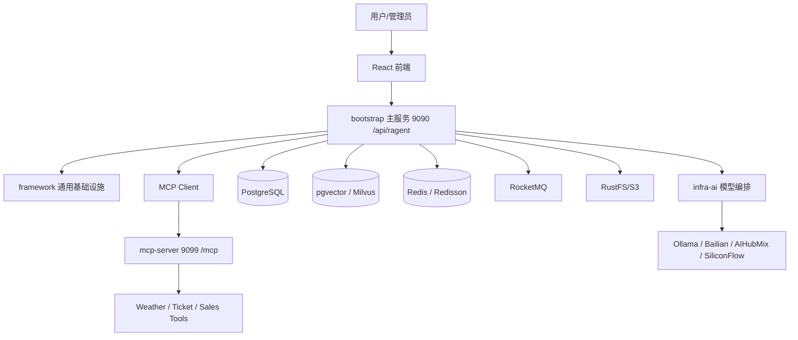
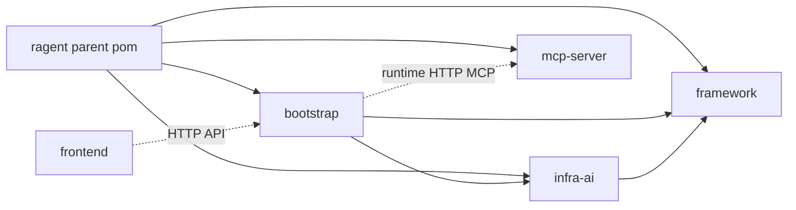
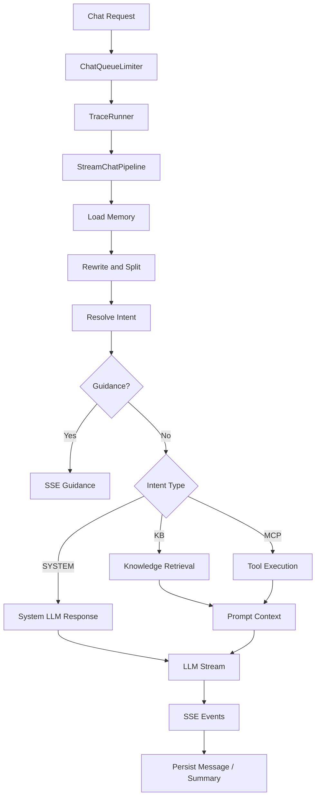
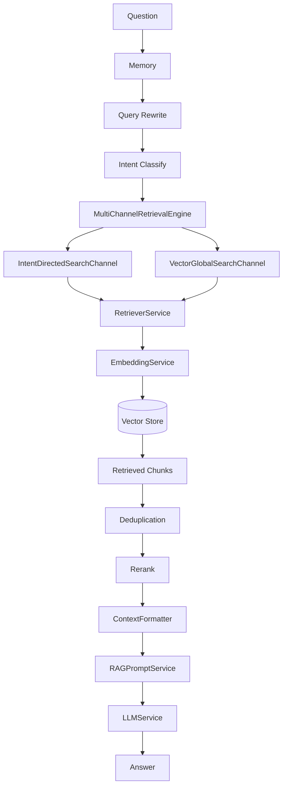
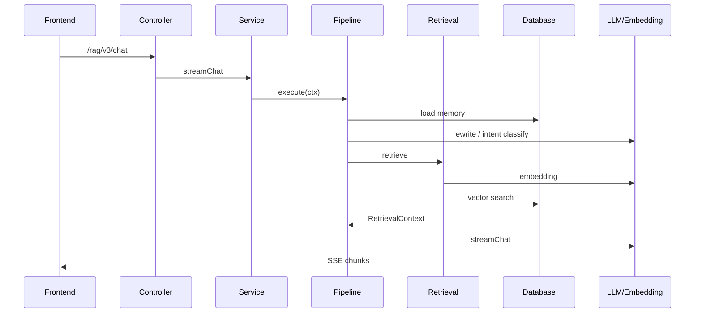

# 架构图总览

# 1. 总体架构图



# 2. 模块关系图



# 3. Agent 流程图



# 4. RAG 流程图



# 5. MCP 流程图

```mermaid
flowchart TD
    A[mcp-server 启动] --> B[ToolSpecification Beans]
    B --> C[McpSyncServer]
    C --> D[/mcp]
    E[bootstrap 启动] --> F[McpClientAutoConfiguration]
    F --> G[listTools]
    G --> H[DefaultMcpToolRegistry]
    I[用户问题] --> J[命中 MCP 意图]
    J --> K[LLM 参数抽取]
    K --> L[McpClientToolExecutor]
    L --> D
    D --> M[Tool Handler]
    M --> N[CallToolResult]
    N --> O[MCP Context]
    O --> P[Prompt + LLM]
```

# 6. 请求调用图


