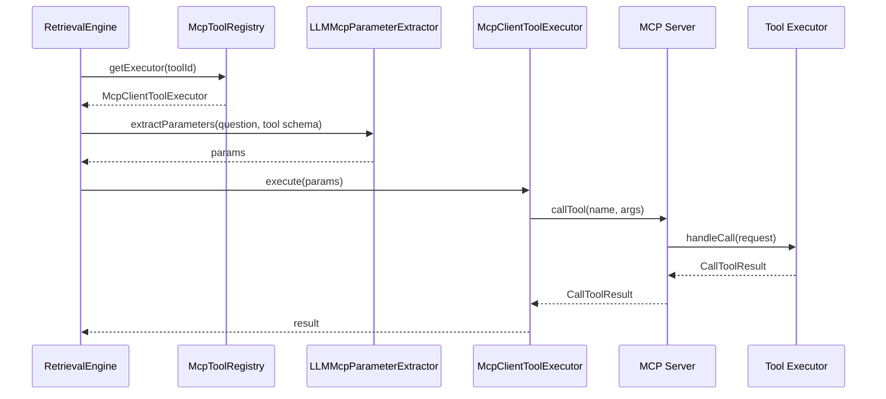

# MCP 架构分析

# MCP Server

MCP Server 是独立模块：

```text
mcp-server
```

启动类：

```text
mcp-server/src/main/java/com/nageoffer/ai/ragent/mcp/McpServerApplication.java
```

配置：

```text
mcp-server/src/main/java/com/nageoffer/ai/ragent/mcp/config/McpServerConfig.java
```

核心 Bean：

- `HttpServletStreamableServerTransportProvider`
- `ServletRegistrationBean`，注册路径 `/mcp`
- `McpSyncServer`

端口：

```yaml
server:
  port: 9099
```

# MCP Tool

当前工具源码位置：

```text
mcp-server/src/main/java/com/nageoffer/ai/ragent/mcp/executor/WeatherMcpExecutor.java
mcp-server/src/main/java/com/nageoffer/ai/ragent/mcp/executor/TicketMcpExecutor.java
mcp-server/src/main/java/com/nageoffer/ai/ragent/mcp/executor/SalesMcpExecutor.java
```

工具暴露方式：

- 每个 Executor 使用 `@Component`。
- 每个工具提供一个 `@Bean`，返回 `McpServerFeatures.SyncToolSpecification`。
- `SyncToolSpecification` 包含：
  - `Tool` 定义：name、description、inputSchema。
  - handler：接收 `CallToolRequest`，返回 `CallToolResult`。

# Tool 注册

Server 侧注册：

```text
McpServerConfig.mcpServer(..., List<McpServerFeatures.SyncToolSpecification> toolSpecs)
```

Spring 会自动收集所有 `SyncToolSpecification` Bean，并传给：

```java
McpServer.sync(transportProvider)
    .serverInfo("ragent-mcp-server", "0.0.1")
    .tools(toolSpecs)
    .build();
```

Client 侧注册：

```text
bootstrap/src/main/java/com/nageoffer/ai/ragent/rag/core/mcp/McpClientAutoConfiguration.java
bootstrap/src/main/java/com/nageoffer/ai/ragent/rag/core/mcp/DefaultMcpToolRegistry.java
```

启动时：

1. 读取 `rag.mcp.servers`。
2. 创建 `McpSyncClient`。
3. `client.initialize()`。
4. `client.listTools()`。
5. 每个远程 Tool 包装为 `McpClientToolExecutor`。
6. 注册进 `DefaultMcpToolRegistry`。

# Tool 发现

主服务配置：

```yaml
rag:
  mcp:
    servers:
      - name: default
        url: http://localhost:9099
```

发现逻辑：

```text
McpClientAutoConfiguration.registerRemoteTools
```

实际访问：

```text
http://localhost:9099/mcp
```

# Tool 调用

调用链：

1. `RetrievalEngine.retrieve`
2. `NodeScoreFilters.mcp`
3. `executeMcpTools`
4. `McpToolRegistry.getExecutor(toolId)`
5. `LLMMcpParameterExtractor.extractParameters`
6. `McpClientToolExecutor.execute`
7. `McpSyncClient.callTool`
8. `mcp-server` 具体工具 handler



# 如何新增一个 MCP Tool

## 方式一：在独立 mcp-server 中新增远程 Tool

新增源码位置：

```text
mcp-server/src/main/java/com/nageoffer/ai/ragent/mcp/executor
```

步骤：

1. 新建 `XxxMcpExecutor`。
2. 标注 `@Component`。
3. 定义唯一 `TOOL_ID`。
4. 提供 `@Bean` 方法返回 `McpServerFeatures.SyncToolSpecification`。
5. 在 `Tool` 中定义 `name`、`description`、`inputSchema`。
6. 在 handler 中读取 `CallToolRequest.arguments()`，返回 `CallToolResult`。
7. 启动 `mcp-server` 后，主服务会通过 `tools/list` 自动发现。
8. 在主服务意图树中配置对应 `mcpToolId`，例如写入 `t_intent_node.mcp_tool_id`。

## 方式二：在主服务内新增本地 McpToolExecutor

新增源码位置：

```text
bootstrap/src/main/java/com/nageoffer/ai/ragent/rag/core/mcp
```

或业务包下单独建 executor。

步骤：

1. 实现 `McpToolExecutor`。
2. 标注为 Spring Bean。
3. `DefaultMcpToolRegistry` 会通过构造器注入的 `List<McpToolExecutor>` 自动发现。
4. 在意图节点配置 `mcpToolId`。

## 推荐方式

优先使用方式一，即放在 `mcp-server`。原因：

- MCP Tool 与主业务解耦。
- 可单独部署、扩展、替换。
- 更符合 MCP 协议的工具服务化设计。

# MCP Mermaid

```mermaid
flowchart TD
    A[mcp-server 启动] --> B[收集 SyncToolSpecification Bean]
    B --> C[McpSyncServer 注册 tools]
    C --> D[/mcp 暴露]
    E[bootstrap 启动] --> F[McpClientAutoConfiguration]
    F --> G[连接 /mcp]
    G --> H[client.listTools]
    H --> I[包装 McpClientToolExecutor]
    I --> J[DefaultMcpToolRegistry]
    K[用户问题] --> L[IntentResolver 命中 MCP 意图]
    L --> M[RetrievalEngine]
    M --> J
    M --> N[LLM 抽取参数]
    N --> O[callTool]
    O --> D
    D --> P[Weather/Ticket/Sales Tool]
    P --> Q[CallToolResult]
    Q --> R[格式化为 MCP Context]
```
