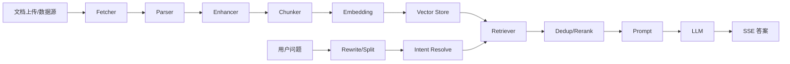
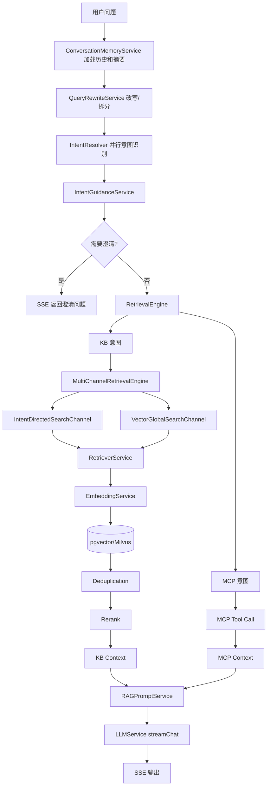
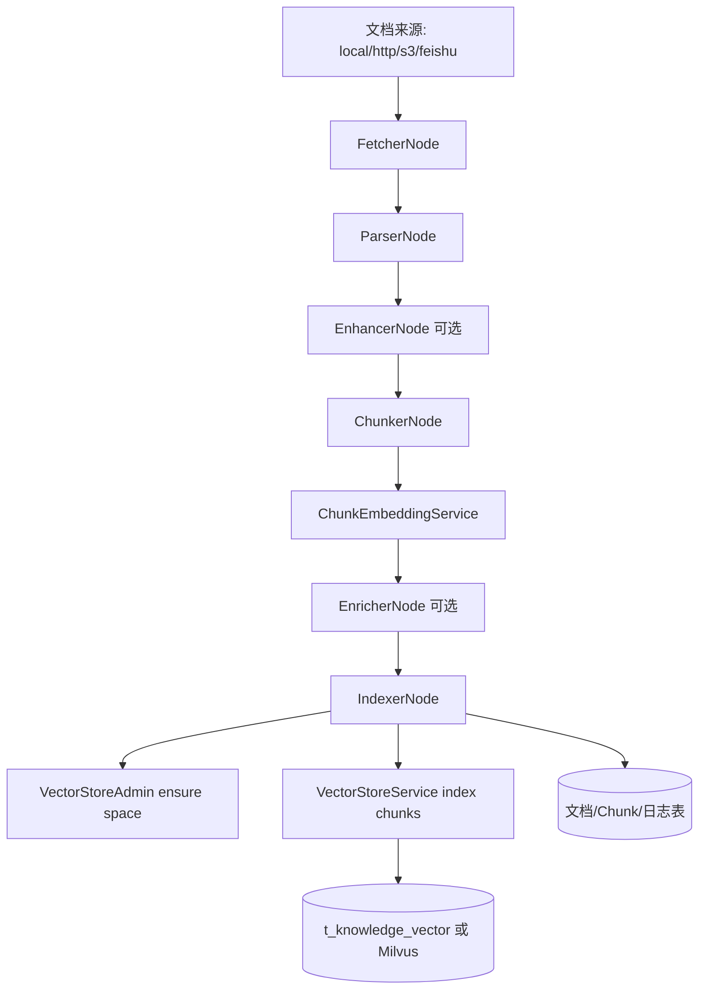

# RAG 架构分析

# 总体链路

RAG 链路分为两部分：

- 入库链路：文档上传、解析、切分、Embedding、向量写入。
- 查询链路：问题改写、意图识别、向量检索、去重、重排、Prompt 组装、大模型生成。



# 文档上传

入口：

- `KnowledgeDocumentController`
- `KnowledgeDocumentServiceImpl`

能力：

- 创建文档记录。
- 上传文件。
- 配置处理模式。
- 触发分块/入库。
- 写入文档状态和处理日志。

上传限流：

- `UploadRateLimitFilter`
- `SemaphoreInitializer`
- Redisson `RPermitExpirableSemaphore`
- 配置：`rag.semaphore.document-upload`

# 文档解析

核心类：

- `DocumentParser`
- `DocumentParserSelector`
- `TikaDocumentParser`
- `MarkdownDocumentParser`
- `TextCleanupUtil`

依赖：

- Apache Tika

作用：

- PDF、DOC、DOCX、Markdown 等文档解析为文本。
- 清理文本噪声。
- 生成 `ParseResult` 或结构化文档。

# Chunk 切分

核心类：

- `ChunkingStrategy`
- `ChunkingStrategyFactory`
- `FixedSizeTextChunker`
- `StructureAwareTextChunker`
- `ChunkingOptions`
- `VectorChunk`

节点：

- `ChunkerNode`

策略：

- 固定长度切分。
- 结构感知切分，识别标题、段落、代码块、原子块。
- 支持 chunk size 和 overlap。

# Embedding

核心类：

- `ChunkEmbeddingService`
- `EmbeddingService`
- `RoutingEmbeddingService`
- `EmbeddingClient`
- `AbstractOpenAIStyleEmbeddingClient`
- `SiliconFlowEmbeddingClient`
- `OllamaEmbeddingClient`
- `AIHubMixEmbeddingClient`

配置：

```yaml
ai:
  embedding:
    default-model: qwen-emb-8b
```

作用：

- 对 Chunk 文本批量生成向量。
- 支持指定模型或使用默认模型。
- 通过模型路由和优先级选择候选模型。

# 向量存储

接口：

- `VectorStoreService`
- `VectorStoreAdmin`

实现：

- `PgVectorStoreService`
- `PgVectorStoreAdmin`
- `MilvusVectorStoreService`
- `MilvusVectorStoreAdmin`

默认配置：

```yaml
rag:
  vector:
    type: pg
```

pgvector 表：

```sql
t_knowledge_vector (
  id,
  content,
  metadata jsonb,
  embedding vector(1536)
)
```

# 向量检索

接口：

- `RetrieverService`

实现：

- `PgRetrieverService`
- `MilvusRetrieverService`

检索入口：

- `RetrievalEngine`
- `MultiChannelRetrievalEngine`

检索通道：

- `VectorGlobalSearchChannel`
- `IntentDirectedSearchChannel`

通道说明：

- 全局向量检索：遍历所有知识库 collection，作为兜底召回。
- 意图定向检索：根据意图节点绑定的知识库/collection 做精确检索。

# 重排

后处理接口：

- `SearchResultPostProcessor`

实现：

- `DeduplicationPostProcessor`
- `RerankPostProcessor`

Rerank 相关类：

- `RerankService`
- `RoutingRerankService`
- `BaiLianRerankClient`
- `NoopRerankClient`

配置：

```yaml
ai:
  rerank:
    default-model: qwen3-rerank
```

# 大模型生成

核心类：

- `RAGPromptService`
- `PromptTemplateLoader`
- `DefaultContextFormatter`
- `LLMService`
- `RoutingLLMService`

Prompt 场景：

- KB only：`answer-chat-kb.st`
- MCP only：`answer-chat-mcp.st`
- KB + MCP：`answer-chat-mcp-kb-mixed.st`
- System：`answer-chat-system.st`

流式输出：

- `StreamChatEventHandler`
- `StreamCallbackFactory`
- `SseEmitterSender`

# RAG 链路在哪些类中实现

| 阶段 | 主要类 |
| --- | --- |
| 用户请求 | `RAGChatController` |
| 对话服务 | `RAGChatServiceImpl` |
| 流水线 | `StreamChatPipeline` |
| 记忆 | `DefaultConversationMemoryService`、`JdbcConversationMemoryStore` |
| 问题改写 | `MultiQuestionRewriteService`、`QueryTermMappingService` |
| 意图识别 | `DefaultIntentClassifier`、`IntentResolver` |
| 澄清引导 | `IntentGuidanceService`、`AmbiguityLLMChecker` |
| 检索编排 | `RetrievalEngine`、`MultiChannelRetrievalEngine` |
| 检索通道 | `VectorGlobalSearchChannel`、`IntentDirectedSearchChannel` |
| 向量检索 | `PgRetrieverService`、`MilvusRetrieverService` |
| 后处理 | `DeduplicationPostProcessor`、`RerankPostProcessor` |
| Prompt | `RAGPromptService`、`PromptTemplateLoader` |
| 生成 | `LLMService`、`RoutingLLMService` |
| 输出 | `StreamChatEventHandler`、`SseEmitterSender` |

# 查询链路 Mermaid



# 入库链路 Mermaid


