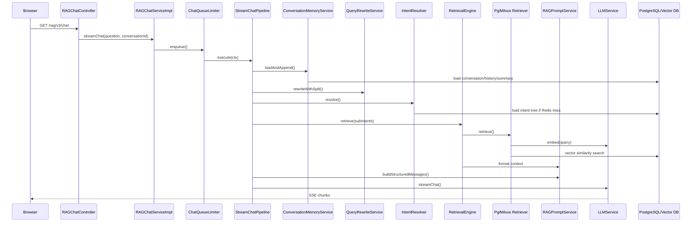
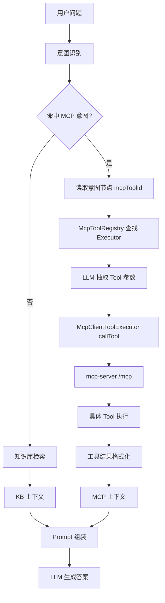
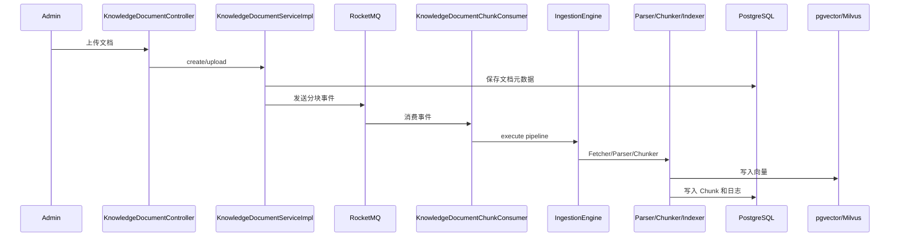
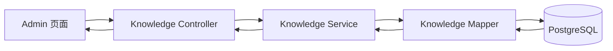
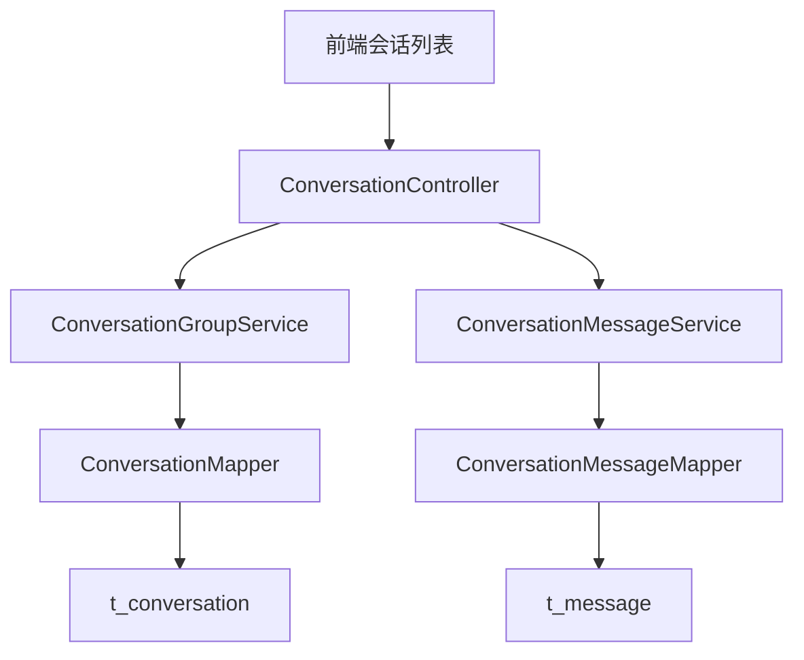

# 请求调用链分析

# 核心业务流程 1：RAG 流式问答

入口：

```text
GET /api/ragent/rag/v3/chat?question=...&conversationId=...&deepThinking=false
```

调用链：

1. `RAGChatController.chat`
2. `RAGChatServiceImpl.streamChat`
3. `ChatQueueLimiter.enqueue`
4. `StreamChatTraceRunner.run`
5. `StreamChatPipeline.execute`
6. `ConversationMemoryService.loadAndAppend`
7. `QueryRewriteService.rewriteWithSplit`
8. `IntentResolver.resolve`
9. `IntentGuidanceService.detectAmbiguity`
10. `RetrievalEngine.retrieve`
11. `MultiChannelRetrievalEngine.retrieveKnowledgeChannels`
12. `SearchChannel.search`
13. `RetrieverService.retrieve`
14. `EmbeddingService.embed`
15. `PgRetrieverService` 或 `MilvusRetrieverService`
16. `DeduplicationPostProcessor`
17. `RerankPostProcessor`
18. `RAGPromptService.buildStructuredMessages`
19. `LLMService.streamChat`
20. `StreamChatEventHandler` 通过 SSE 推送前端



# 核心业务流程 2：MCP 工具型问答

当意图节点是 MCP 类型时，请求不会只走知识库检索，而是触发工具调用。

调用链：

1. `RAGChatController.chat`
2. `StreamChatPipeline.execute`
3. `IntentResolver.resolve`
4. `RetrievalEngine.retrieve`
5. `NodeScoreFilters.mcp`
6. `executeMcpTools`
7. `McpToolRegistry.getExecutor`
8. `LLMMcpParameterExtractor.extractParameters`
9. `McpClientToolExecutor.execute`
10. 远程 `mcp-server /mcp`
11. `WeatherMcpExecutor` / `TicketMcpExecutor` / `SalesMcpExecutor`
12. `ContextFormatter.formatMcpContext`
13. `RAGPromptService`
14. `LLMService.streamChat`



# 核心业务流程 3：知识文档上传与入库

入口在 `KnowledgeDocumentController`，文档处理最终进入入库 Pipeline 或知识库分块逻辑。

核心类：

- `KnowledgeDocumentController`
- `KnowledgeDocumentServiceImpl`
- `KnowledgeDocumentChunkConsumer`
- `IngestionEngine`
- `FetcherNode`
- `ParserNode`
- `ChunkerNode`
- `IndexerNode`



# 核心业务流程 4：后台查询知识库文档

调用链：

1. `KnowledgeBaseController` / `KnowledgeDocumentController` / `KnowledgeChunkController`
2. 对应 Service
3. MyBatis-Plus Mapper
4. PostgreSQL 表



# 核心业务流程 5：会话历史查询

调用链：

1. `ConversationController`
2. `ConversationGroupService` / `ConversationMessageService`
3. `ConversationMapper` / `ConversationMessageMapper`
4. `t_conversation` / `t_message`


