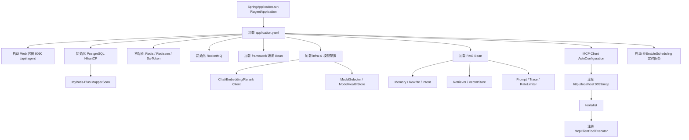

# 启动入口

## 主服务入口

主启动类：

```text
bootstrap/src/main/java/com/nageoffer/ai/ragent/RagentApplication.java
```

关键注解：

- `@SpringBootApplication`
- `@EnableScheduling`
- `@MapperScan`

Mapper 扫描包：

- `com.nageoffer.ai.ragent.rag.dao.mapper`
- `com.nageoffer.ai.ragent.ingestion.dao.mapper`
- `com.nageoffer.ai.ragent.knowledge.dao.mapper`
- `com.nageoffer.ai.ragent.user.dao.mapper`

主服务端口：

```yaml
server:
  port: 9090
  servlet:
    context-path: /api/ragent
```

## MCP 服务入口

独立 MCP Server 启动类：

```text
mcp-server/src/main/java/com/nageoffer/ai/ragent/mcp/McpServerApplication.java
```

端口：

```yaml
server:
  port: 9099
```

MCP endpoint：

```text
http://localhost:9099/mcp
```

# 启动过程

1. Spring Boot 加载 `RagentApplication`。
2. 读取 `bootstrap/src/main/resources/application.yaml`。
3. 初始化 Web 容器，绑定 `9090` 和 `/api/ragent`。
4. 初始化数据源 HikariCP，连接 PostgreSQL。
5. 初始化 MyBatis-Plus 插件和 Mapper。
6. 初始化 Redis、Redisson、Sa-Token Redis 适配。
7. 初始化 RocketMQ producer/consumer。
8. 加载 `framework` 通用 Bean。
9. 加载 `infra-ai` 模型配置、Chat/Embedding/Rerank Client、模型路由和健康状态。
10. 加载 RAG 配置、线程池、Prompt Loader、Memory、Intent、Retriever、MCP Client、Trace AOP。
11. 初始化 MCP Client，连接配置中的 MCP Server，调用 `tools/list` 并注册远程工具。
12. 启动定时任务，包括知识库文档定时刷新。

# 自动配置

## Web 自动配置

位置：

- `framework/config/WebAutoConfiguration`
- `bootstrap/rag/config/WebConfig`
- `bootstrap/rag/config/Utf8ResponseFilter`

职责：

- 统一 Web 配置。
- UTF-8 响应。
- 用户上下文拦截。
- Demo 模式拦截。

## 数据库自动配置

位置：

- `framework/config/DataBaseConfiguration`
- `framework/database/MyMetaObjectHandler`

职责：

- MyBatis-Plus PostgreSQL 分页插件。
- 自动填充创建时间、更新时间等元字段。
- Mapper 由启动类显式扫描。

## AI 模型配置

位置：

- `infra-ai/config/AIModelProperties`
- `infra-ai/model/ModelSelector`
- `infra-ai/model/ModelRoutingExecutor`
- `infra-ai/model/ModelHealthStore`

职责：

- 读取 `ai.providers`、`ai.chat`、`ai.embedding`、`ai.rerank`。
- 根据候选模型优先级选择目标模型。
- 维护模型失败次数、OPEN/HALF_OPEN/CLOSED 状态。

## MCP Client 自动配置

位置：

- `bootstrap/rag/core/mcp/McpClientAutoConfiguration`
- `bootstrap/rag/core/mcp/DefaultMcpToolRegistry`

职责：

- 读取 `rag.mcp.servers`。
- 连接远程 MCP Server。
- 初始化 `McpSyncClient`。
- 调用 `listTools()` 发现 Tool。
- 将每个 Tool 包装为 `McpClientToolExecutor` 并注册进 `McpToolRegistry`。

# Bean 加载

核心 Bean：

- RAG Pipeline：`StreamChatPipeline`
- RAG Service：`RAGChatServiceImpl`
- Memory：`DefaultConversationMemoryService`、`JdbcConversationMemoryStore`、`JdbcConversationMemorySummaryService`
- Rewrite：`MultiQuestionRewriteService`、`QueryTermMappingService`
- Intent：`DefaultIntentClassifier`、`IntentResolver`、`IntentTreeCacheManager`
- Retrieve：`RetrievalEngine`、`MultiChannelRetrievalEngine`
- SearchChannel：`VectorGlobalSearchChannel`、`IntentDirectedSearchChannel`
- PostProcessor：`DeduplicationPostProcessor`、`RerankPostProcessor`
- MCP：`DefaultMcpToolRegistry`、`LLMMcpParameterExtractor`
- Vector：按 `rag.vector.type` 条件加载 `PgVectorStoreService` 或 `MilvusVectorStoreService`
- ThreadPool：`ThreadPoolExecutorConfig` 中 9 个 Executor

# 配置加载

主配置文件：

```text
bootstrap/src/main/resources/application.yaml
```

MCP Server 配置：

```text
mcp-server/src/main/resources/application.yml
```

未发现 `application-dev.yml`、`application-test.yml`、`application-prod.yml`、`bootstrap.yml`。

# 数据源初始化

配置：

```yaml
spring:
  datasource:
    driver-class-name: org.postgresql.Driver
    type: com.zaxxer.hikari.HikariDataSource
    username: postgres
    password: postgres
    url: jdbc:postgresql://127.0.0.1:5432/ragent?client_encoding=UTF8
```

表结构来源：

```text
resources/database/schema_pg.sql
resources/database/init_data_pg.sql
```

# Redis 初始化

配置：

```yaml
spring:
  data:
    redis:
      host: 127.0.0.1
      port: 6379
      password: 123456
```

Redis 相关 Bean：

- `StringRedisTemplate`
- `RedissonClient`
- Sa-Token Redis Adapter
- `FairDistributedRateLimiter`
- `IntentTreeCacheManager`
- `QueryTermMappingCacheManager`

# MCP 初始化

主服务：

```yaml
rag:
  mcp:
    servers:
      - name: default
        url: http://localhost:9099
```

MCP Server：

- `McpServerConfig.transportProvider()` 创建 HTTP Streamable Transport。
- `mcpServlet()` 将 Transport 注册到 `/mcp`。
- `mcpServer()` 收集所有 `SyncToolSpecification` Bean。

# Agent 初始化

Agentic 编排 Bean 随 Spring 容器启动加载：

- `StreamChatPipeline`
- `IntentResolver`
- `DefaultIntentClassifier`
- `RetrievalEngine`
- `McpToolRegistry`
- `RAGPromptService`
- `LLMService`

它们没有单独的 Agent 启动器，而是在每次 `/rag/v3/chat` 请求进入后构造一次 `StreamChatContext` 并执行。

# Mermaid 流程图


